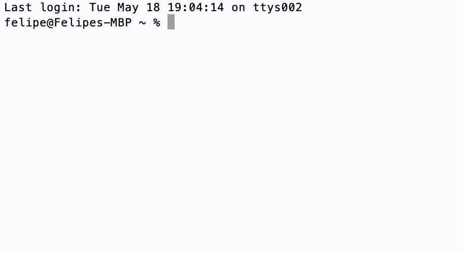
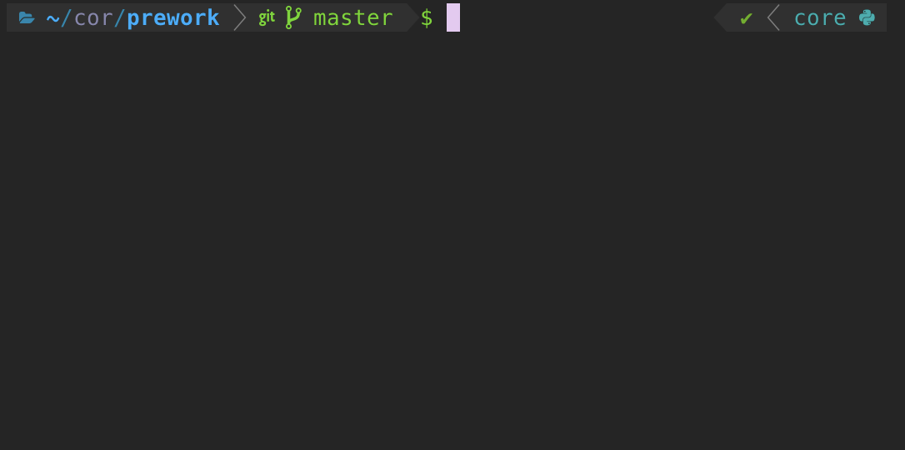
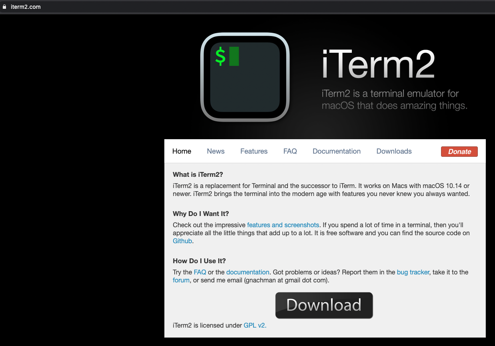
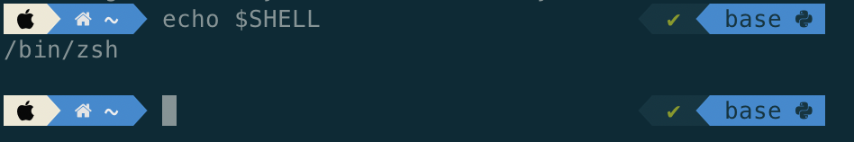
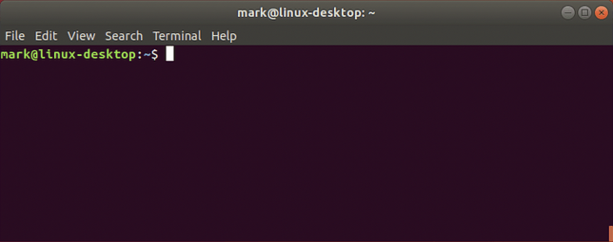
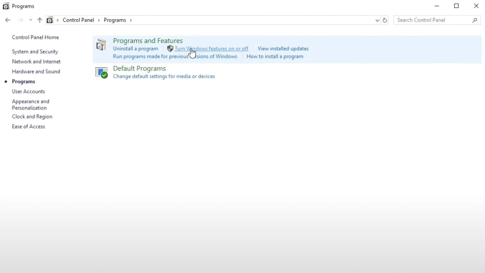
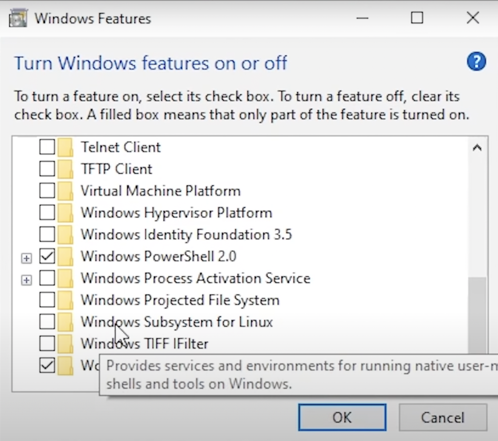
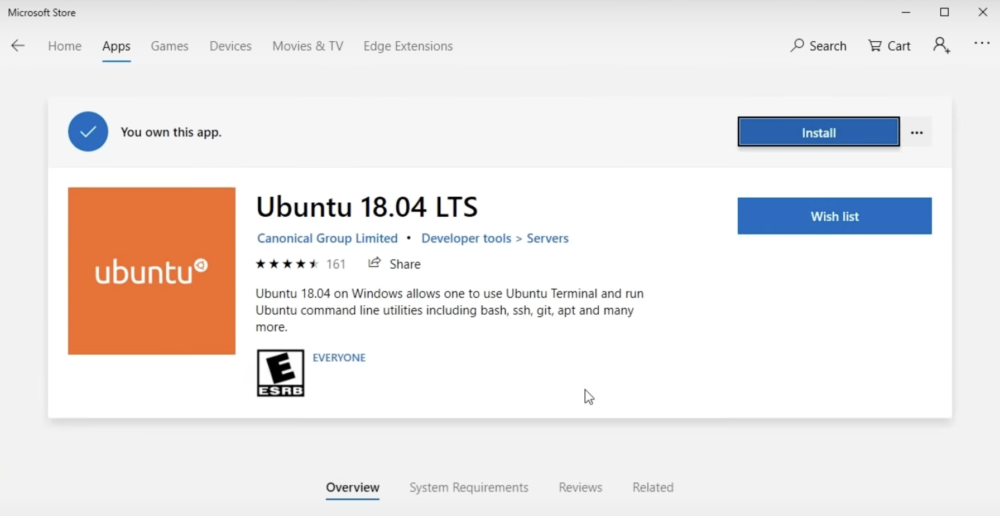
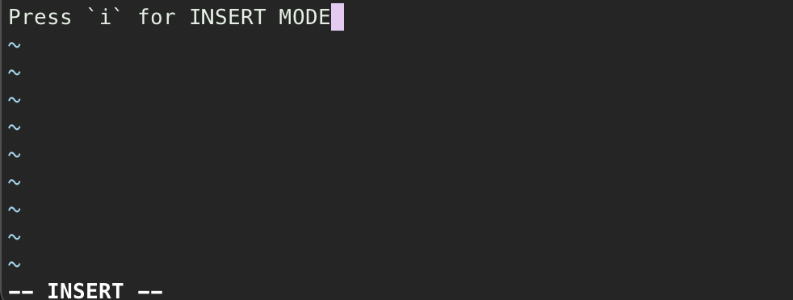
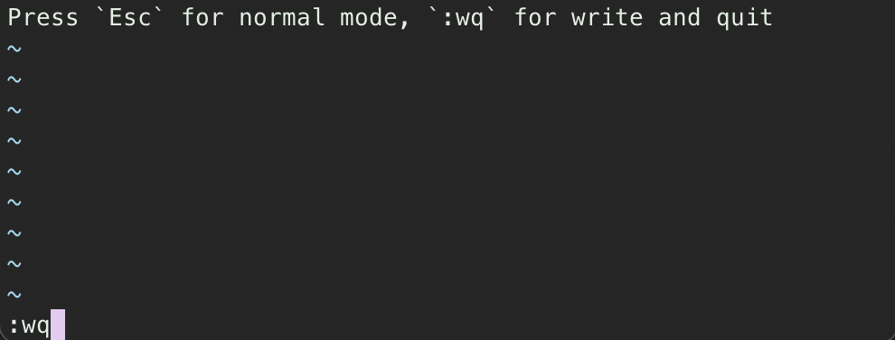

# Terminal set-up

En esa sección del prework vamos a preparar algunas herramientas para crear un entorno de programación cómodo y con las utilidades que necesitemos. Una de las herramientas que más emplearemos en nuestra carrera como desarrolladores es la `terminal`, pues ella nos da acceso a cualquier información de nuestro ordenador y a los programas que necesitaremos.

## Getting Ready

Si utilizas macOS o Linux, ambos sistemas operativos del tipo Unix, solamente necesitarás verificar que los programas básicos están listos. De manera opcional añadiremos algunos extras para darle "más gusto" a nuestra terminal.

Por otro lado, si usas Windows (que es un sistema operativo distinto a los dos anteriores) necesitaremos instalar algunas cosas extra para poder trabajar. Como la mayor parte de las herramientas de desarrollo están hechas para sistemas Unix, instalaremos el `Windows Subsystem for Linux`, que hará nuestro ordenador compatible con este sistema.

¡Ve a la sección correspondiente de tu Sistema Operativo y empezamos!

- [macOS](#macos)
- [Linux](#linux)
- [Windows](#windows)

## macOS

### Homebrew

[Homebrew](https://brew.sh/) es un gestor de paquetes para macOS, es decir, brew es un programa que sirve para instalar otros programas. Por lo tanto, es importante que lo tengamos listo para poder instalar diferentes herramientas.

Abre tu Terminal buscando `Terminal` en el Spotlight Search o en el launcher, copia el siguiente comando y ejecútalo:

```shell
/bin/bash -c "$(curl -fsSL https://raw.githubusercontent.com/Homebrew/install/HEAD/install.sh)"
```

### Git

Necesitamos asegurarnos que el gestor de versiones `git` también está instalado. Lo verificamos con el comando:

```shell
git --version
```

Si recibimos como respuesta la información de la versión de git, está listo. Pero si la respuesta es de `command not found`, instalamos git con el siguiente comando:

```shell
xcode-select --install
```

### [OPCIONAL] iTerm2 + Oh My Zsh

Hemos visto en el paso anterior la app de terminal por defecto en macOS. La gran mayor parte de los desarrolladores entretanto, eligen utilizar otra aplicación llamada `iTerm2` por disponer de más posibilidades de configuración. También nos permite instalar `Oh My Zsh`, un framework para tunear nuestra terminal.

En esa sección convertiremos nuestra terminal por defecto:


En esto:


Además de los evidentes cambios cosméticos, la segunda versión de la terminal muestra información que antes no estaba disponible, i.e.: el status de los repositorios git y el entorno virtual activo, ambas cosas que utilizaremos.

### Paso 1 - Instalar iTerm2

Desde la pagina de [iTerm2](https://iterm2.com/) descarga el instalador y sigue las instrucciones que te indique el programa y ¡listo!, ya podemos abrir iTerm y usarlo en lugar de Terminal.



### Paso 2 - Instalar Oh My Zsh

En las versiones más modernas de macOS, se usa `zsh` por defecto. Puedes verificar esta información con el comando:

```shell
echo $SHELL
```



Si obtenemos una respuesta como `/usr/bin/zsh`, podemos proseguir con la instalación de `Oh My Zsh`. En el caso contrario, sigue los siguientes pasos:

1. Verifica que no está instalado en tu equipo con el siguiente comando:

```shell
zsh --version
```

2. Emplea tu Homebrew, tu nuevo gestor de paquetes en Mac OS, para instalar zhs:

```shel
brew install zsh
```

3. Para configurar zsh como tu shell por defecto ejecuta:

- Para versiones recientes de Mac OS:

```shell
chsh -s /usr/local/bin/zsh
```

- Mac OS High Sierra y anteriores:

```shell
chsh -s /bin/zsh
```

Puedes encontrar más información y las instrucciones oficiales en el [repositorio oficial de ohmyzsh](https://github.com/ohmyzsh/ohmyzsh/wiki/Installing-ZSH#macos).

Podemos visitar la documentación de [Oh My Zsh](https://github.com/ohmyzsh/ohmyzsh/wiki) para una instalación por línea de comandos:

```shell
sh -c "$(curl -fsSL https://raw.githubusercontent.com/ohmyzsh/ohmyzsh/master/tools/install.sh)"
```

Para configurar el nuevo framework que acabamos de instalar, tenemos que acceder al fichero de configuración `~/.zshrc`, lo que podemos hacer a través la terminal con:

```shell
nano ~/.zshrc
```

Utilizando las flechas de dirección busca `ZSH_THEME="robbyrussell"` y cámbialo por `ZSH_THEME="agnoster"` que es uno de los temas más populares. Para guardar el cambio en nano, hacemos `Ctrl + X`, la `Y` de yes para la pregunta y el `Enter` para confirmar. Es necesario cerrar y reabrir la terminal para que los cambios surtan efecto.

Para más opciones de temas, consulta la siguiente [documentación](https://github.com/ohmyzsh/ohmyzsh/wiki/Themes).

> Puede ser necesaria la instalación de [Powerline Fonts](https://github.com/powerline/fonts) para el funcionamiento de los temas. Puedes encontrar las instrucciones se encuentran en el repo.

> Otro tema popular es el [Powerlevel10k](https://github.com/romkatv/powerlevel10k#get-started), cuyas instrucciones están en el enlace: sigue las opciones para Oh My Zsh.

## Linux

Como es posible que sepas, existen muchas distribuciones diferentes de Linux. Para estas instrucciones usaremos como ejemplo `Ubuntu`, que es una de más populares, pero verás que la guía de instalación para otras distribuciones serán muy similares.

### Git

Necesitamos asegurarnos que el gestor de versiones [git](https://git-scm.com/) también está instalado. Lo verificamos con el siguiente comando en la terminal:

```shell
git --version
```

> Para abrir la terminal, podemos usar el hotkey:
>
> `Ctrl + Alt + T`

Si recibimos como respuesta la información de la versión de git, está listo. Pero si la respuesta es de `command not found`, instalamos git con el comando:

```shell
sudo apt install git-all
```

### [OPCIONAL] Oh My Zsh

Hemos visto en el paso anterior la app de terminal por defecto en Ubuntu. Podemos opcionalmente instalar `Oh My Zsh`, un framework para tunear nuestra terminal.

En esa sección convertiremos nuestra terminal de esto:


En esto:


Además de los cambios cosméticos, la segunda versión nos enseña información que no está disponible en la primera, i.e.: el status de los repositorios git y el entorno virtual activo, ambas cosas que utilizaremos.

### Paso 1 - Instalar Zsh

Antes necesitamos [instalar zsh](https://github.com/ohmyzsh/ohmyzsh/wiki/Installing-ZSH) y definirlo como nuestra shell en lugar de `bash`.

En la terminal podemos instalarlo con el comando:

```shell
sudo apt install zsh
```

Después de la instalación lo ejecutamos con el comando `zsh` seguido de intro. Y le cambiamos a la shell por defecto con:

```shell
chsh -s $(which zsh)
```

### Paso 2 - Instalar Oh My Zsh

Puedes consultar la documentación de [Oh My Zsh](https://github.com/ohmyzsh/ohmyzsh/wiki) y emplear la instalación por líneas de comando:

```shell
sudo apt install curl
```

Seguido de:

```shell
sh -c "$(curl -fsSL https://raw.githubusercontent.com/ohmyzsh/ohmyzsh/master/tools/install.sh)"
```

Para configurar el nuevo framework que acabamos de instalar, tenemos que acceder al fichero de configuración `~/.zshrc`. Podremos hacerlo desde la misma terminal con:

```shell
gedit ~/.zshrc
```

Busca `ZSH_THEME="robbyrussell"` y cámbialo por `ZSH_THEME="agnoster"` que es uno de los temas favoritos. Es necesario cerrar y reabrir la terminal para que los cambios surtan efecto.

Para más opciones de temas, consulta la [documentación](https://github.com/ohmyzsh/ohmyzsh/wiki/Themes).

> Puede ser necesaria la instalación de [Powerline Fonts](https://github.com/powerline/fonts) para el funcionamiento de los temas. Las instrucciones se encuentran en el repo.

> Otro tema popular es el [Powerlevel10k](https://github.com/romkatv/powerlevel10k#get-started), cuyas instrucciones están en el enlace, sigue las opciones para Oh My Zsh.

## Windows

### WSL (Windows Subsystem for Linux)

Para poder utilizar las herramientas y comandos de sistemas Unix en Windows, necesitaremos el WSL.

Para poder instalar una versión de Linux en nuestro Windows, primero necesitamos habilitar esa opción. Abrimos el `Control Panel` y vamos a la sección `Programs`.



En esa sección, debemos elegir la opción `Turn Windows features on and off`, que nos abrirá una nueva lista de opciones.



Activa la opción `Windows Subsystem for Linux` y pulsa Ok. Se iniciará la instalación y al final será necesario reiniciar el ordenador.

Ahora que el WSL está activado, podemos instalar una versión de Linux. En el `Microsoft Store`, busca Ubuntu y procede a su instalación.



Cuando ejecutes el programa por la primera vez, se completará la instalación y se te pedirá que crees un nombre de usuario y contraseña.

> A partir de ese momento, cuando nos refiramos a la terminal estaremos hablando de la terminal de ubuntu.

Aprovechamos ese momento para actualizar el gestor de paquetes y programas con los 2 siguientes comandos en la terminal que acabamos de instalar:

```shell
sudo apt-get update
sudo apt-get upgrade
```

### Git

Necesitamos asegurarnos que el gestor de versiones [git](https://git-scm.com/) también está instalado. Lo verificamos con el siguiente comando en la terminal:

```shell
git --version
```

Si recibimos como respuesta la información de la versión de git, está listo. Pero si la respuesta es de `command not found`, instalamos git con el comando:

```shell
sudo apt install git-all
```

### [OPCIONAL] hyper.js + Oh My Zsh

Para una terminal más visual y con más configuraciones podemos instalar `hyper.js`, un nuevo programa que servirá como nuestra terminal y `Oh My Zsh`, un framework para la shell.

### Paso 1 - Instalar hyper

Para instalar [hyper](https://hyper.is/), descarga desde su página web el ejecutable y sigue las instrucciones en pantalla. Una vez lo instalado, necesitamos configurarlo para el WSL que instalamos previamente.

Abre hyper y accede a las configuraciones con `Ctrl + ,`

En las configuraciones, buscamos la línea que se refiere a `shell` y `shellArgs`, las cambiamos por:

```
shell: 'ubuntu.exe',
shellArgs: [],
```

### Paso 2 - Instalar Zsh

Antes necesitamos [instalar zsh](https://github.com/ohmyzsh/ohmyzsh/wiki/Installing-ZSH) y definirlo como nuestra shell en lugar de `bash`.

En la terminal podemos instalarlo con el comando:

```shell
sudo apt install zsh
```

Después de la instalación, ejecutamos con el comando `zsh` seguido de intro. Y le cambiamos a la shell por defecto con:

```shell
chsh -s $(which zsh)
```

### Paso 3 - Instalar Oh My Zsh

Podemos visitar la documentación de [Oh My Zsh](https://github.com/ohmyzsh/ohmyzsh/wiki), la instalación también se da por líneas de comando:

```shell
sudo apt install curl
```

Y a continuación:

```shell
sh -c "$(curl -fsSL https://raw.githubusercontent.com/ohmyzsh/ohmyzsh/master/tools/install.sh)"
```

Para configurar el nuevo framework que acabamos de instalar, tenemos que acceder al fichero de configuración `~/.zshrc`, lo que podemos hacer por la terminal con:

```shell
vim ~/.zshrc
```

> Para editar un texto en vim, presionamos `i` para entrar en el modo de edición. Después de los cambios, pulsamos `Esc` para salir del modo de edición, escribimos el comando `:wq` (que deberá escribirse en la parte inferior de la pantalla) y damos al `Enter` para guardar y salir.





Utilizando las flechas direccionales busca `ZSH_THEME="robbyrussell"` y cámbialo por `ZSH_THEME="agnoster"` que es uno de los temas favoritos. Es necesario cerrar y reabrir la terminal para que los cambios surtan efecto.

Para más opciones de temas, consulta la [documentación](https://github.com/ohmyzsh/ohmyzsh/wiki/Themes).

> Puede ser necesaria la instalación de [Powerline Fonts](https://github.com/powerline/fonts) para el funcionamiento de los temas. Las instrucciones se encuentran en el repo.

> Otro tema popular es el [Powerlevel10k](https://github.com/romkatv/powerlevel10k#get-started), cuyas instrucciones están en el enlace, sigue las opciones para Oh My Zsh.
