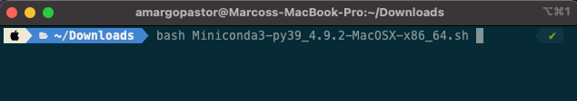

# Prepare your interpreter

## Python

A partir de ese momento, Python será nuestro mejor amigo y nuestro lenguaje por defecto en el bootcamp.
Este lenguaje es muy popular entre los Data Analysts y Data Scientists por su flexibilidad, ser Open-Source y disponer de cantidad de documentación, incluyendo una serie de librerías con diferentes funcionalidades.

Python es un lenguaje de programación de `alto nivel`, `multi-paradigma` e `interpretado`. Pero, ¿qué significa todo esto?

> ## Alto Nivel
>
> Un lenguaje de programación de alto nivel se refiere al nivel de abstracción necesario con respecto a los detalles específicos de nuetro ordenador. Es decir, no tenemos que preocuparnos con las particularidades del hardware (la parte física del ordenador): su memoria, procesadores, etc. Por ello Python es compatible con multitud de plataformas y su uso a la hora de programar es más asequible.
>
> ## Multi-paradigma
>
> En programación existen diferentes maneras de trabajar nuestro código o `paradigmas`. De los cuales nosotros destacamos los dos más famosos: programación funcional y programación orientada a objetos. Python es flexible y nos permite utilizar ambos o una combinación de ellos.
>
> ## Interpretado
>
> Como hemos visto anteriormente, el lenguaje de programación es una capa de abstracción sobre las particularidades del procesador del ordenador. El ordenador, entretanto, no entiende ese lenguaje: nuestro equipo solo trabaja con el llamado `Lenguaje de Máquina` o `Machine Code`. Para poder ejecutar nuestro código, por lo tanto, necesitamos un programa que haga las veces de traductor. Nos referimos al `compilador`.

Muchos lenguajes utilizan `compiladores`, que toman su tiempo y compilan (o traducen) todo el código a un archivo ejecutable. En el caso de Python no usamos un compilador, sino que un `interprete`, que tiene el papel de un traductor simultáneo, se ocupa de esta tarea.

El código se va traduciendo al lenguaje del procesador parte a parte según se va ejecutando. Eso nos da la ventaja de tener una visión inmediata de la ejecución de nuestro programa, facilitando el proceso de creación, debugging (corrección de errores) e implementación de nuevas aplicaciones, aumentando así la flexibilidad.

## El entorno virtual

¡Trataremos de preparar nuestro intérprete para todas nuestras necesidades Python! Para eso dependeremos de un gestor de entornos virtuales llamado `conda`.

> ## Conda enviroment
>
> Un entorno virtual es una instancia del intérprete de python. Es decir, cuando creamos un nuevo entorno estamos creando un nuevo intérprete, con sus propias configuraciones y dependencias. De esta manera tendremos no solo un único intérprete python sino tantos como necesitemos. Todo ello nos permite, principalmente:
>
> - Poder probar diferentes librerías sin tener problemas: es más fácil borrar un entorno virtual y volver a empezar que tener que reestructurar todo el sistema.
> - Tener diferentes proyectos en diferentes entornos nos facilitan identificar las dependencias de cada uno y minimizan problemas de incompatibilidad de librerías.
>
> 
>
> Con conda podemos tener multiples Pythons, cada cual puede ser de una version, tener librerias diferentes, etc. En una terminal solo podemos tener un unico entorno activado a la vez, pero en cada terminal poderiamos tener un entorno diferente. El entorno activo definirá cual será el interprete Python que usaremos y que librerias estaran disponibles.

## Instalación

Para preparar nuestro `conda`, vamos a descargar la versión apropiada de [miniconda](https://docs.conda.io/en/latest/miniconda.html). Nosotros te recomendamos descargar la versión Python 3.9.

> ### macOS
>
> Si eres usuario de MAC debes descargar la versión `Miniconda3 MacOSX 64-bit bash` (asegúrate de que es la versión `bash`).
> 

> ### Linux y Windows con WSL
>> Si usas Windows, asegúrate de haber completado la instalación de WSL. Revisa la sección de Terminal Setup. 
>
> Tanto si eres usuario de Linux como de Windows, puedes descargar la versión llamada `Miniconda3 Linux 64-bit`
> 

Una vez que tengamos descargado el fichero, sea cual sea el sistema operativo, debemos navegar en la terminal hasta la carpeta donde lo hayamos guardado (por ejemplo `~/Downloads`). Windows users, aseguraos de que estéis usando la terminal de WSL.

En la carpeta correcta debemos ejecutar el comando siguiente:

```shell
bash Miniconda3-latest-MacOSX-x86_64.sh
```

> Atención: El nombre del fichero debe coincidir con el fichero que acabamos de descargar.
> TIP: si escribimos `bash Miniconda` y pulsamos el tabulador (TAB), el nombre del fichero deberá autocompletarse.



Le y sigue las instrucciones en pantalla. 


> Si tienes un Mac con procesador Apple Silicon M1, puedes recibir un `WARNING` como ese, contesta `yes` para seguir en la instalación.

Pulsa `Enter` para ver los términos y condiciones. Para salir del documento, puedes pulsar `q` y contesta `yes` para seguir la instalación.


Debemos instalar en el directorio que sugira el instalador por defecto.


Al final, el instalador nos preguntará si deseamos que se ejecute `conda init`. Es importante que digamos que sí.


Una vez terminada la instalación, será necesario cerrar y volver a abrir la terminal para que se reflejen los cambios. En ese momento deberíamos ver la palabra `(base)` en el prompt de nuestra terminal. Eso indica el entorno en el cual estamos, a priori el base.

>
>
> En Oh My Zsh con el tema Powerlevel10k, el entorno aparece a la derecha del prompt, por ejemplo.

Podemos ejecutar un comando como `conda list` para probar el funcionamiento y actualizar con `conda update conda`.


## Crear un nuevo entorno

El ideal es que no trabajemos en el entorno base, entonces ahora toca crear un nuevo entorno para que podamos trabajar. Todo esto se hará desde la línea de comandos.

```shell
conda create --name core python=3.9
```


Creamos un entorno para usar al largo del bootcamp, llamado `core`. Cuando nos pregunte el wizard si deseamos seguir, contestamos `yes`. Pero todavía no estamos usando ese entorno. 


Es necesario activarlo:

```shell
conda activate core
```

Una vez activado el entorno deberíamos ver el `(base)` cambiado a `(core)`.


Si verificamos cuál es el intérprete con el comando `which python`, deberíamos obtener una respuesta como la siguiente:

```
/Users/$USERNAME/miniconda/envs/core/bin/python
```


Ese es el directorio donde está el intérprete del entorno virtual `core`.

> Será necesario activar el entorno virtual cada vez que abramos la terminal. Si deseas que la terminal siempre se abra en un determinado entorno, por ejemplo el de `core`, podemos añadir el comando al fichero `.zshrc` con:
>
> ```bash
> echo "conda activate core" >> ~/.zshrc
> ```

## Ejecutando codigo python

Ahora que el intérprete está configurado podemos usarle para ejecutar código Python. ¡Vamos a probar!

Con un editor de texto (TextEdit, Gedit, Notepad), crea un nuevo fichero llamado `version.py`. Utilizamos la extensión `.py` para indicar que el contenido de un fichero es código en Python.
En ese fichero, escribiremos el siguiente código:

```python
import sys
print("Python version")
print (sys.version)
print("Version info.")
print (sys.version_info)
```

Guardamos y ya podemos ejecutarlo. Para eso, desde la terminal, navegamos a la carpeta donde guardamos ese fichero y ejecutamos el comando:

```shell
python version.py
```

Si todo ha funcionado correctamente, deberíamos recibir un output en la terminal con información sobre la versión de python, similar a:

```
Python version
3.9.4 | packaged by conda-forge | (default, May 10 2021, 22:10:52)
[Clang 11.1.0 ]
Version info.
sys.version_info(major=3, minor=9, micro=4, releaselevel='final', serial=0)
```

## Instalar librerias

Con nuestro entorno preparado, podemos instalar librerías con uno de los siguientes comandos:

- `conda install`
- `pip install`

Ambos comandos son válidos y apenas usan gestores de paquetes diferentes. Como estamos en un entorno virtual conda, damos preferencia al primero.

Siempre que necesites instalar una librería nueva, puedes verificar que recomienda la documentación oficial o podemos buscar en Google por `conda install <nombre de la librería>`.

Probemos a instalar algunas de las librerías que usaremos al largo del bootcamp para conocer el proceso. Para ello, con el entorno de core activado, ejecuta el comando:

```shell
conda install pandas matplotlib scipy scikit-learn jupyter
```

Cuando el sistema pregunte si deseamos continuar, nosotros responderemos `y`.

Una vez haya finalizado el proceso de instalación podemos verificar las librerías instaladas con el comando `conda list`.
Verás más librerías de las que acabamos de instalar: son sus dependencias y veremos algunas de ellas más adelante.

No te preocupes por instalar todas las librerías de antemano. Como el proceso es muy sencillo y rápido, según surja la necesidad de una librería, la instalamos.
