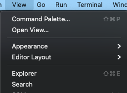
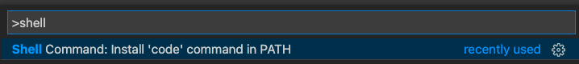
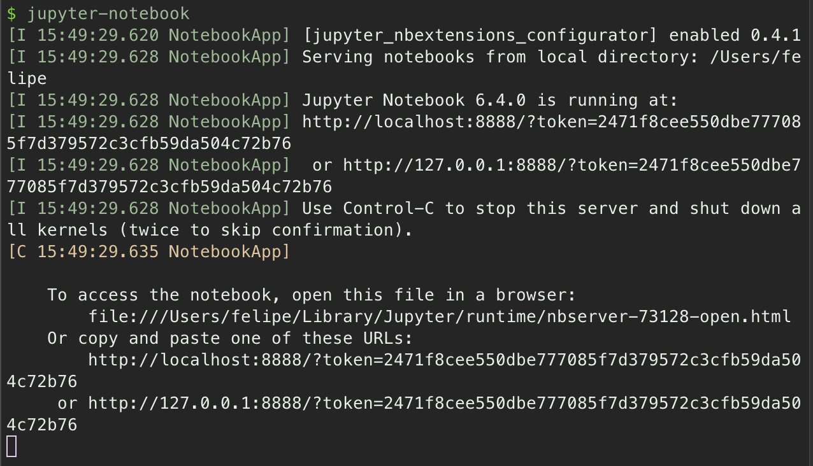
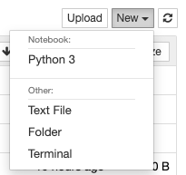
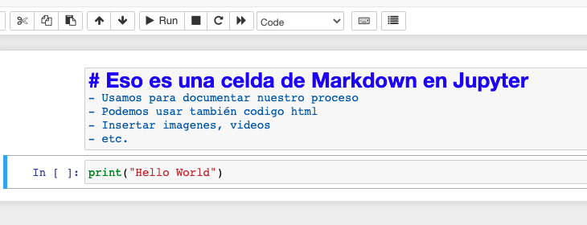
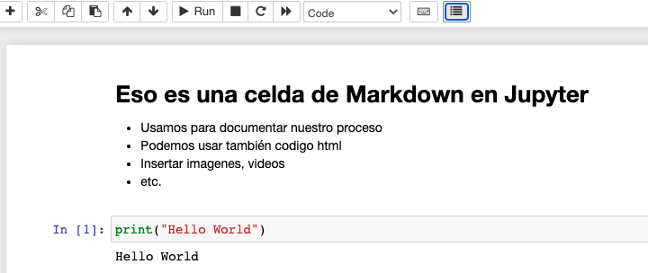

# Writing code

En esta sección, veremos algunas herramientas que podemos utilizar para el desarrollo de nuestro código. En esencia, el código es apenas texto. Y por lo tanto cualquier editor de texto, como el propio bloc de notas, es viable para escribir código.

Pero, por la facilidad de tener un repertorio de opciones, muchas aplicaciones existen dedicadas específicamente a la escritura de código que proporcionan comodidad al desarrollador. Cada programador tiene sus preferencias y utiliza diferentes editores o IDE. Nosotros te recomendamos que investigues, pruebes y elijas el que mejor se adapte a ti. Algunos de los editores más usados por los programadores son: Sublime, VIM, Spider, Atom, PyCharm, Emacs, etc.

Veremos aquí dos de nuestros favoritos y que usaremos al largo del bootcamp:

> ### VScode
>
> `Visual Studio Code` es un editor de código de Microsoft, pero con soporte en múltiples plataformas. Tiene una gran cantidad de integraciones con otras aplicaciones y plug-ins para ayudarnos.
>
> ### Jupyter Notebook
>
> `Jupyter notebook` es una librería de Python que nos permite tener una plataforma para crear `notebooks`: documentos que mezclan celdas interactivas de código y documentación en Markdown. Aunque jupyter no sea una herramienta para escribir scripts de Python puro, por su interactividad son excelentes para hacer pruebas y análisis de datos.

## Instalando Visual Studio Code

La instalación de VScode es bastante sencilla, como la de cualquier aplicación. Entramos en la [página de downloads](https://code.visualstudio.com/download), descargamos la versión apropiada y seguimos las instrucciones en pantalla.

> Si eres usuario de Windows no debes emplear WSL para la descarga. Descarga la versión Windows y sigue los pasos del ejecutable.

> ¿Qué es `WSL`? ¡Revisa nuestra documentación en `preparando tu intérprete`!

Una vez instalado abrimos VScode. Para integrarlo en nuestra terminal, abrimos el `Command Palette` pulsando `Ctrl + Shift + P` (alternativamente `⇧+⌘+P` en macOS) o por el menú en `View -> Command Palette`.



En la caja de diálogo del command palette, escribimos la palabra `Shell` y pulsamos la opción `Shell Command: Install 'code' command in PATH`.



> Si esta opción no sale disponible, probablemente ya tienes `code` en el PATH y no hace falta ninguna acción.

Todo esto nos permitirá abrir vscode desde la terminal con el comando `code`. Igualmente podemos abrir vscode en cualquier directorio o fichero con el mismo comando seguido del path, por ejemplo:

```shell
code version.py
```

## Instalando Jupyter Notebook

Como hemos visto en la sección `Prepare your Interpreter`, para instalar librerías en Python podemos usar el comando `conda install` si usamos entornos virtuales o `pip install`. Dicho esto, para instalar Jupyter Notebook usaremos el comando:

```shell
conda install jupyter
```

Una vez que esté instalado, para abrir Jupyter, usamos el comando `jupyter-notebook` en la terminal.

Veremos un output como el siguiente:



Eso significa que el servidor de jupyter está activo en nuestro ordenador. Esta terminal debe permanecer abierta mientras lo usamos. Si necesitamos utilizarla, debemos abrir una nueva pestaña en la misma terminal.

Si no se ha abierto automáticamente, podemos copiar uno de los enlaces en el output y abrirle en el navegador. Jupyter funciona através del navegador como una página web.

Podemos navegar por las carpetas y crear nuevos ficheros del tipo `notebook`.



En los notebooks hay basicamente dos tipos de celda:


Las de tipo `Code` sirven para escribir en Python y ejecutar, las de `Markdown` sirven para la documentación. Podemos insertar y editar cuantas celdas queramos y en cualquier orden.



Una vez escritas, podemos ejecutar una celda con el botón de run o con el atajo `Ctrl + Enter`.



Una vez terminemos de trabajar, guardamos los notebooks y cerramos jupyter desde la terminal que estamos ejecutando con el comando `Ctrl + C`.
