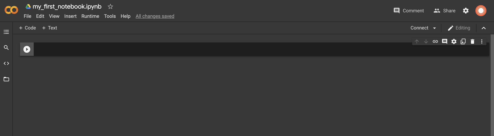
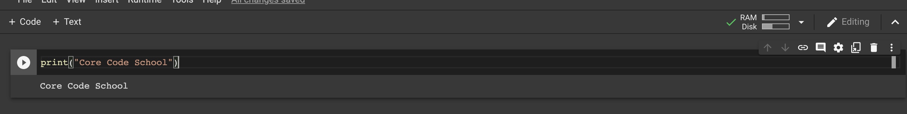
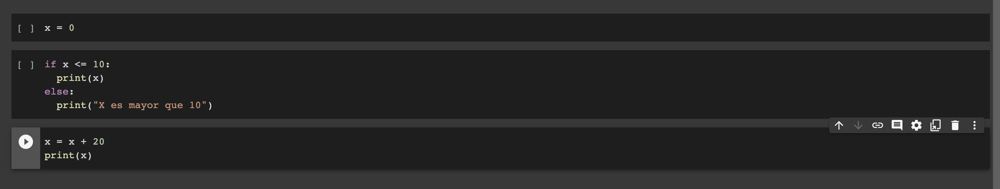
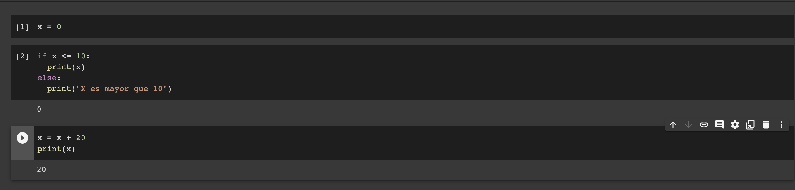
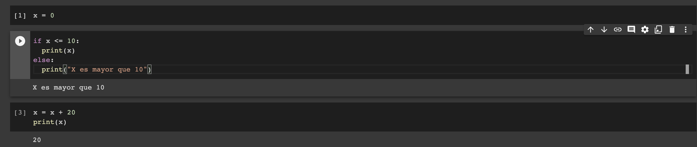
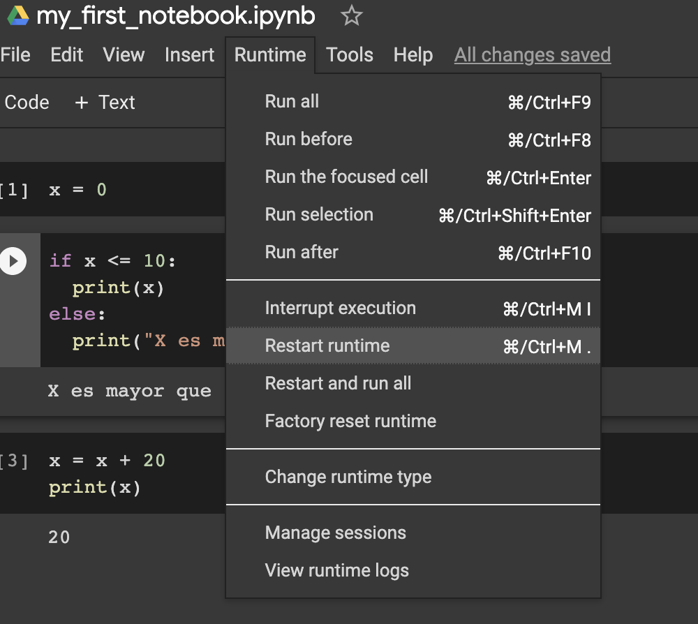
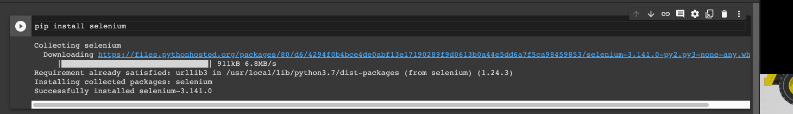
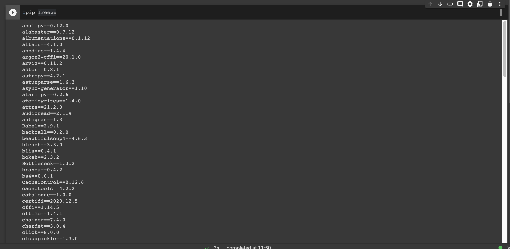

# My First Google Colab

Ahora que ya hemos superado la sección de `Set-up`, tenemos todo preparado para un buen ambiente de desarrollo Python. Veremos entretanto una herramienta más, llamada `Google Colab`, que no requiere ningún setup. Google dispone un servicio gratuito: [Google Colaboratory](https://colab.research.google.com/), donde podemos crear y ejecutar archivos del tipo `Jupyter Notebook`, como los que vimos en `Writing Code`.

## Getting Started



Todo lo que necesitamos para empezar a usar Colab es escribir en las celdas. Podemos utilizar el botón de `play` para ejecutar la celda, o más cómodamente uno de los `hotkeys`:

- `Ctrl+Enter`: Ejecuta la celda selecionada
- `Shift+Enter`: Ejecuta la celda selecionada y seleciona la siguiente
- `Alt/Option+Enter`: Ejecuta la celda selecionada y crea una nueva celda abajo

La primera vez que ejecutes una de las celdas el proceso pude tardar unos segundos: este es el tiempo que tarda el programa en conectar con uno de los ordenadores de Google. En Colab toda la computación ocurre en `la nube` en servidores de Google, no en nuestro propio ordenador.

>  > _- Nuestro primer código ejecutado en la nube_

## Multiple cells

A diferencia de los scripts tradicionales donde el código de nuestro fichero se ejecuta de principio a fin, en los notebooks el código puede estar dividido entre diferentes celdas.

Es importante prestar atención al orden de ejecución de esas celdas, ya que las variables pertenecen a todo el notebook y diferentes celdas pueden afectarlas.

Miremos el siguiente código compartido entre 3 celdas:



Si ejecutamos las 3 celdas en secuencia obtendremos el siguiente output:



Si entretanto volvemos a ejecutar solamente la segunda celda:



El output de la segunda celda cambia pues al ejecutarla por la segunda vez, la tercera ya se había ejecutado y por lo tanto el valor de `x` había cambiado.

## Restarting the Kernel

Si por algún motivo fuera necesario limpiar la asignación de todas las variables para empezar desde el cero o si alguna función se quedara congelada, podemos fácilmente reiniciar el proceso.



Cuando reiniciemos el kernel será como si ningún código hubiera sido ejecutado y, por lo tanto, ninguna variable habrá sido declarada.

## Libraries in Colab

Si necesitamos importar alguna librería, lo hacemos normalmente con `import libreria`. Si la librería no está disponible, la podemos instalar en Colab (recuerda que se trata de un enviroment Python en un ordenador de Google, no el nuestro) ejecutando el comando `pip install` en una celda con un `!` antes del comando. Por ejemplo:



Muchas librerías ya están disponibles por defecto. Para listarlas todas utiliza en una celda el comando:

```
!pip freeze
```


