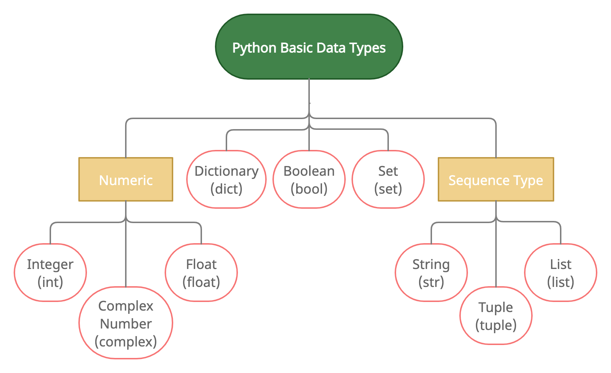

# Variables and Data Types

Ahora que ya hemos visto los principios básicos de como operar nuestros notebooks en Colab, podemos empezar a practicar los fundamentos de la sintaxis Python. Abre el Colab notebook llamado `Python_basics.ipynb` que se ha compartido contigo ¡y empezamos!

Python es un `lenguaje` de programación y, como los lenguajes naturales (Español, Inglés, etc.), tienen su propia gramática: un conjunto de reglas que permite el funcionamiento y la comprensión del lenguaje.

El propósito del lenguaje influye mucho en su gramática. El objetivo de un lenguaje de programación como Python es `imperativo`, es decir, ¡está hecho para emitir órdenes! Por lo tanto, programar en su sentido más básico se puede imaginar como redactar una serie de órdenes para que las cumpla el ordenador. Python es un lenguaje genial para este propósito. Si en Español tenemos sustantivos, verbos, adjetivos, adverbios, etc., en Python tenemos otros elementos fundamentales, como `variables, funciones, operadores, objetos, decoradores, etc.`

> En la primera parte del notebook, encontrarás un video de 60 segundos explicando de manera general que es un lenguaje de programación. 📽

## Variables

El elemento fundamental de la programación es la `variable`. Una variable es un espacio de memoria donde se almacena un "valor" para poder ser procesado. Un valor no refiere solamente a un número: en Python podemos utilizar variables para almacenar `números, textos, listas, objetos, funciones, etc.`.

El proceso de almacenar un valor a una variable recibe el nombre de `asignación` o `asignar`, y se representa por el operador `=`. Para utilizar el operador asignación necesitamos dos operandos:

- El propio valor
- El nombre que queremos dar a la variable

```Python
gato = "Garfield"
```

Imagina que Python tuviera un enorme archivador (llamado `Namespace`) en la memoria de nuestro ordenador. A un cajón le pone la pegatina con el nombre de la variable y dentro le pone el valor que queremos guardar.


En muchos lenguajes, para poder asignar una variable, tenemos que definir cuál será el tipo de dato que almacenaremos. Eso es para que en la ejecución el programa elija un cajón compatible con el que queremos guardar.

Pero en Python tenemos cajones mágicos en nuestro archivador (como todo truco de magia, se trata de un proceso oculto 🧙‍♀️). Esos cajones se adaptan al dato que le pongamos y podemos reutilizarlos para diferentes tipos de datos.

> En el `ejercicio 1.1` en el colab notebook probaremos si los cajones de Python son realmente tan mágicos. 😜

## Descubriendo el tipo de una variable

Como las variables en Python tienen tanta flexibilidad, muchas veces necesitaremos saber cuál es el tipo de dato que está contenido en esa variable. Para ello podemos emplear la función `type`:

```Python
x = "Core Code School"
print(type(x))
```

Este código nos debería devolver la siguiente respuesta:

```
<class 'str'>
```

> Explora esta función con diferentes tipos variables en el `ejercicio 1.2`. Hemos dejado un **bonus** para que pongas a prueba el resultado de esa función y que investigues por tu cuenta. 🔍

## Convirtiendo el tipo de datos

Hay operaciones o funciones que son incompatibles con determinados tipos de datos.

Para eso tenemos que utilizar de operaciones llamadas `casting`, que se resumen en convertir un dato de un tipo a otro. Son funciones como `int, float, list, tuple, dict, str` que convierten un dato al tipo especificado. Por ejemplo:

```Python
x = 3.5
print(x, type(x))
x = str(x)
print(x, type(x))
```

Al ejecutar ese código, el output sería:

```
3.5 <class 'float'>
3.5 <class 'str'>
```

Hemos conseguido convertir el valor decimal `3.5` a una cadena de texto. Pero no todos los datos se pueden convertir a todos los tipos. Por ejemplo, el `string` "Garfield" no se puede convertir a un tipo numérico, pero sí se puede convertir a un tipo lista.

> En el `ejercicio 1.3`, usarás el casting para sumar una lista de tipos mixtos de datos.

## Python Basic Data Types

Hemos visto que hay diferentes tipos (también llamados clases) de datos y durante el bootcam aprenderemos a crear nuestros propios tipos de datos, pero ¿cuáles son los tipos básico? Los tipos de datos que vienen por defecto en Python están representados abajo.



## Numeric

Como dice su nombre, estos son los datos que se refieren a los números. Hay 3 tipos de ellos y se puede operar entre ellos (por ejemplo, sumar ints y floats).

> ### Integer
>
> Son los números enteros, representados por el tipo `int`.

> ### Float
>
> Los números de clase `float` reciben su nombre de `decimal floating-point`y son los números decimales. Siempre se representan los decimales con `.` como separador.

> ### Complex Number
>
> Menos común que los dos tipos anteriores, Python también es compatible con números complejos, que poseen parte real y parte imaginaria. En Python se representan como `3+7j`.

## Sequence Type

> ### List
>
> Las listas son secuencias `ordenadas mutables` de valores. Esto es, los objetos del tipo `list` son su propio tipo de dato y también son contenedores de otros datos, como si dentro de uno de los cajones del gran archivador pusiéramos una caja y dentro de esa caja guardáramos otros objetos.
>
> Las listas se representan con los corchetes `[]`. Y los objetos que pueden contener son de cualquier tipo: numéricos, strings, diccionarios e incluso otras listas.
>
> Al tratarse de objetos `ordenados`, se puede iterar con `bucle for` por los elementos de la misma lista y acceder a sus valores a través de un índice numérico que representa su posición en la secuencia.
>
> > Los índices siempre empiezan por el número `0`, que representa la primera posición. También pueden ser números negativos, contando hacia atrás. El índice `-1` se refiere al último elemento de una lista.
>
> Para seleccionar un elemento de una lista usamos corchetes. También se pueden seleccionar secciones de una lista, en ese caso usamos dos números separados por `:`.
>
> ```Python
> lst = [1,2,3,4,5,6,7,8,9]
> print(lst[0], lst[3])
> print(lst[-1], lst[-2])
> print(lst[2:5])
> ```
>
> Output:
>
> ```
> 1 4
> 9 8
> [3, 4, 5]
> ```
>
> Como objetos `mutables`, las listas se pueden cambiar añadiendo o removiendo elementos. Para eso utilizamos métodos (un tipo de función) como `append`, `insert`, `remove` y `pop`.
>
> Puedes consultar esos y otros métodos de las listas y su utilización consultando la [documentación oficial de Python](https://docs.Python.org/3/tutorial/datastructures.html).
>
> Probaremos algunas de esos métodos en los `ejercicios 1.4, 1.5 y 1.6`.

> ### Tuple
>
> Las tuplas, como las listas, son secuencias `ordenadas`, pero estas son `inmutables`. Por lo tanto, son muy similares a las listas en su funcionamiento en relación con los índices y los bucles. Al contrario de las listas, las tuplas se representan con paréntesis `()`.
>
> Pero al tratarse de elementos inmutables, no se pueden añadir, cambiar o remover elementos. Una vez definidas, lo único que se puede hacer es reasignar otro valor a la misma variable.

> ### String
>
> Las cadenas de texto también son secuencias `ordenadas` e `inmutables`, como las tuplas. Pero todos los elementos de los strings son caracteres. Los strings se representan con comillas dobles o simples: `"`, `'`.
>
> También puedes acceder a sus elementos o `slices` de sus elementos con los índices entre corchetes.
>
> ```Python
> string = "Core Code School"
> print(string[0], string[-2])
> print(string[2], string[-8])
> print(string[0:4])
> ```
>
> Output:
>
> ```
> C o
> r e
> Core
> ```
>
> Por sus características particulares, los strings tienen una serie de métodos propios, especiales para la manipulación de textos. Por ejemplo, métodos como `join`, `strip`, `split`, `lower`, `upper`. Los métodos de los strings y otros tipos también se encuentran en la [documentación de Python](https://docs.Python.org/3/library/stdtypes.html).
>
> Si queremos completar un texto con valores de variables, podemos utilizar los `f-strings` o `format strings`. Se hace con un `f` antes de las comillas y los valores que queremos substituir van entre llaves `{}`.
>
> ```Python
> y = 1991
> print(f"Python was launched on the year {y}")
> ```
>
> Practicaremos con los strings en los `ejercicios 1.7 y 1.8`.

> ### Boolean
>
> Los valores boleanos son valores lógicos `True` y `False`. Cuando utilizamos los condicionales `if`, cada condición se evaluará como uno de los valores booleanos para decidir si se cumplirá el bloque de código condicional.
>
> La lógica boleana usa frecuentemente los operadores `and`, `or` y `not`.

> ### Set
>
> Los sets son secuencias de valores `sin orden` y `mutables` cuyos elementos no se pueden repetir, como en los conjuntos matemáticos.
>
> Una lista, tupla o string puede ser convertido a un set para obtener los elementos no repetidos que contengan. Los sets también poseen métodos para la unión, intersección, etc.
>
> Los sets son representados por las llaves `{}`.
>
> ```Python
> string = "Core Code School"
> print(set(string))
> ```
>
> Output:
>
> ```
> {'C', 'h', 'd', ' ', 'c', 'l', 'e', 'r', 'o', 'S'}
> ```

> ### Dictionary
>
> Al igual que los sets, los diccionarios también se representan por las llaves `{}`, son `mutables` y `sin orden`.
> Lo que les caracteriza entretanto es que cada elemento es compuesto por un par `clave: valor`.
>
> Para acceder a los elementos de un diccionario o para crear elementos nuevos, usamos los corchetes como en los índices, pero en lugar de números, usamos las claves.
>
> ```Python
> dic = {"a":55, "b":"B"}
> print(dic["a"]/5)
> dic["hello"] = "world"
> print(dic)
> ```
>
> Output:
>
> ```
> 11.0
> {'a': 55, 'b': 'B', 'hello': 'world'}
> ```
>
> De esta manera, como no se pueden repetir elementos en un set, no se pueden repetir `keys` (claves) en los diccionarios.
> Cualquier objeto puede ser `value` en un dict, pero no todos pueden ser `keys`. Por ejemplo, los objetos mutables como las listas no pueden ser keys.

Practicaremos más de los conceptos de esa lección en el `ejercicio 1.9`, pero no cierres el colab todavía. Seguiremos practicando en la sección `Control Flow`.
