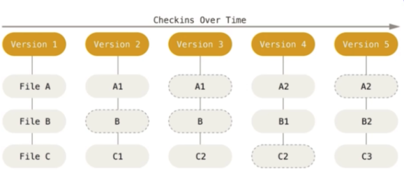
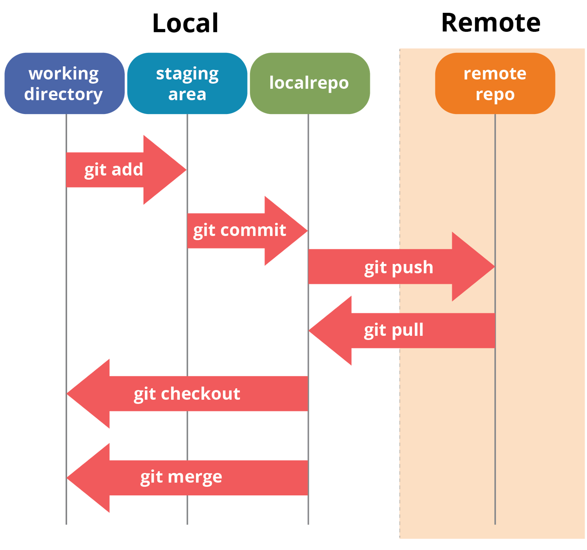

# CORE Code School

# Git intro

## Git

`GIT: Software de control de versiones`. Software de control de versiones diseñado por Linus Torvalds, pensando en la eficiencia y la confiabilidad del mantenimiento de versiones de aplicaciones cuando estás tieen un gran número de archivos de código fuente.

`Control de versiones`: Es un conjunto de procedimientos que registran los cambios realizados en un archivo o un conjunto de los mismos. Nos permite recuperar el estado de nuestros archivos en distintos momentos del tiempo (`recuperación de versiones`).

- Ventajas:

  - Operaciones locales
  - No internet
  - No borra
  - Integridad

Durante el bootcamp trabajaremos git mediante la `terminal`.

`Repositorios`: Punto donde se almacenan todos nuestros archivos. Hay dos tipos: `local` y `remoto`.

`GitHub`: Red social de programadores.

`Terminal`: Acceso e interacción con nuestro sistema operativo y optimización del trabajo como desarrolladores. Todos los OS tienen su propio sistema de terminal.

## Git en tu ordenador

- Working Directory: trabajo local
- Staging Area: control de cambios desde git con `git add .`
- local: hacemos "permanentes" cambios al repo con `git commit`
- remote: control de cambios en github con  `git push`

### commit

Se conoce como `commit` la acción de guarda el estado de una carpeta en un momento temporal.

### branch

Las llamadas `ramas o branchs` no son más que una sucesión de eventos temporales. En nuestro caso, la sucessión de commits conformorán nuestra branch.

> Los archivos cuya estensión termina en .md (`READ.md`, por ejemplo) indican que poseen un formato marckdown.

### More info

- [Atlassian-git-cheatsheet](https://www.atlassian.com/git/tutorials/atlassian-git-cheatsheet)
