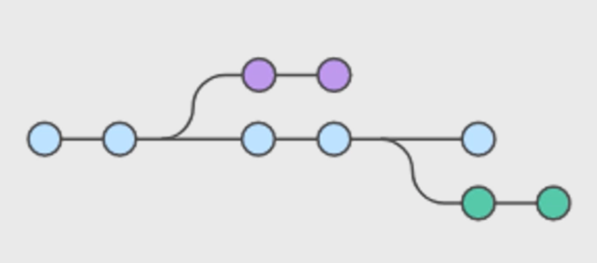
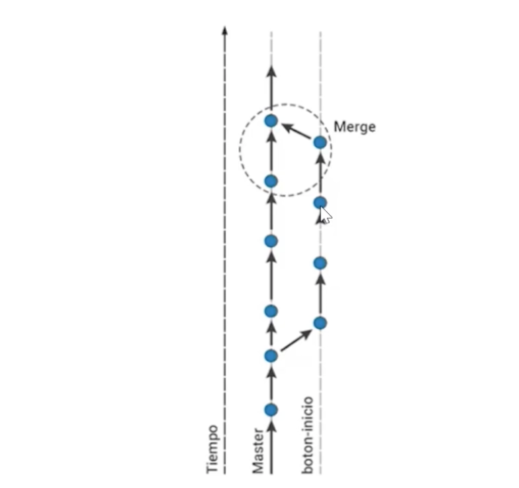
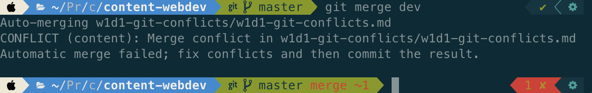
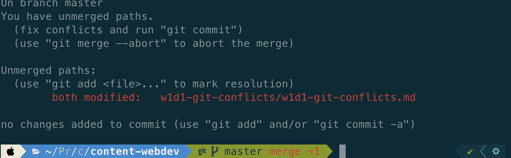
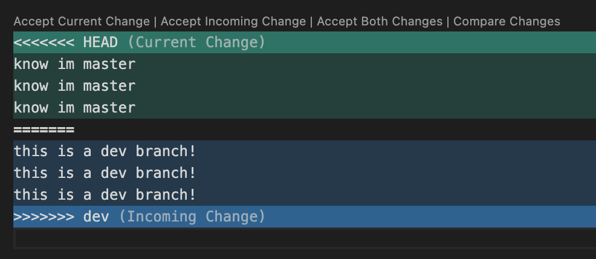
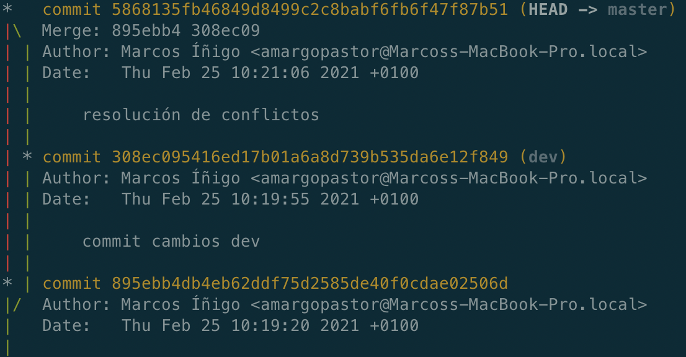
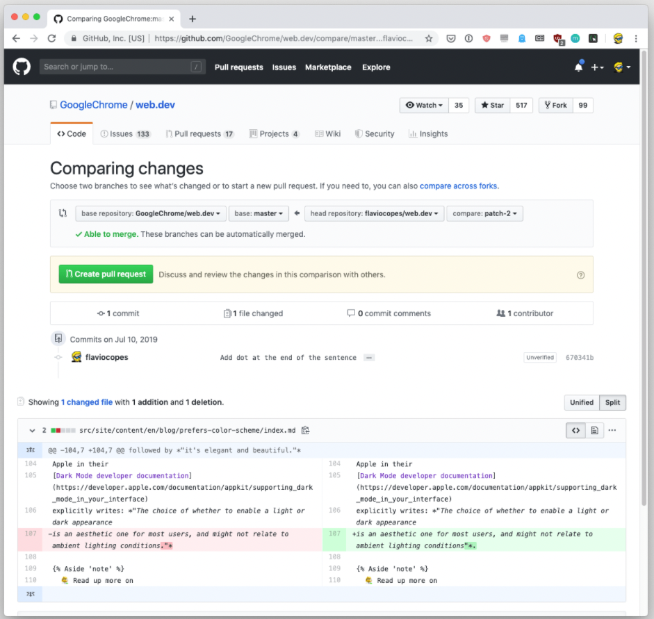
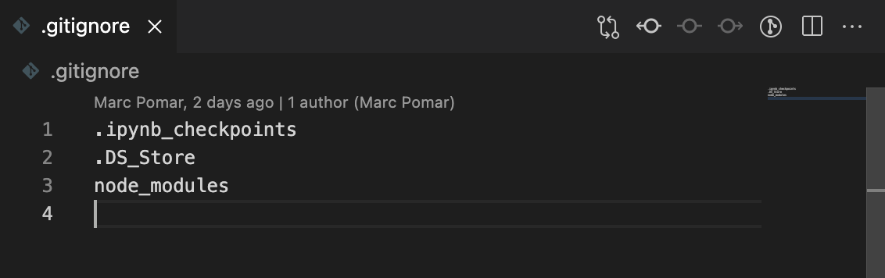

# CORE Code School

# Github intro

## Github

Es una red social de código o lo que podríamos llamar un portfolio de programadores. Se comparte el código público y almacenamos nuestro código privado utilizando el sistema de `control de versiones`.

Para poder utilizar GitHub es necesario crear una cuenta en [github.com](https://github.com/).

Para crear nuevo repositorio debemos acceder a [github.com/new](https://github.com/new).

Herramientas similares: [Bitbucket](https://bitbucket.org/) o [GitLab](https://about.gitlab.com/).

### Sincronizando con GITHUB

- Create a new repository on the command line:

`echo "# my-core" >> README.md`

`git init`

`git add README.md`

`git commit -m "first commit"`

`git branch -M main`

`git remote add origin https://github.com/amargopastor/my-core.git`

`git push -u origin main`

- Push an existing repository from the command line

`git remote add origin https://github.com/amargopastor/my-core.git`

`git branch -M main`

`git push -u origin main`

## Branches

Una `rama o branch` es una sucessión de commits. De cada rama pueden surgir nuevas branchs con trabajos en paralelo:



Un `merge` es la unión de dos líneas de trabajo en una sola:



- `git branch <branch_name>`: crear nueva branch
- `git checkout <branch_name>`: cambio de branch
- `git merge <rama_modificada>`: unión de ramas (desde rama principal). Se borra la rama mergeada.

## Repositorios remotos

La siguiente lista describe el proceso paso por paso para trabajar de manera correcta repositorios remotos:

1. Forkeamos repositorio público ajeno con las opciones de github.
2. Clonamos NUESTRO repositorio de github creado gracias al fork con git clone https://github.com/<username>/<repo_name>.git en nuestro equipo.

```
$ mkdir core
$ cd core
$ git clone https://github.com/<miusuario>/webdev1120
$ cd webdev1120

```

5. Nos conectamos a ambos repositorios (nuestro y externo):

`git remote add github https://github.com/<org_name>/<repo_name>.git`

`git remote add origin https://github.com/<username>/<repo_name>.git`

4. Ejecutamos pull los cambios del remote github a nuestro repo local con: `git pull github master`
5. Push de la versión actualizada local a nuestro remote: `origin git push origin master`

A la hora de trabajar los ejercicios diarios debemos:

- Realizar un `git pull upstream main` desde el repositorio forkeado. Esto descargará los ultimos cambios realizados en los enunciados de los ejercicios.

- Crear una rama nueva desde `master` con el nombre `wXdX` cada vez que empezamos un ejercicio nuevo.

- El titulo de la `pull-request` debe ser: `[WXDX] <nombre>`. Ejemplo `[W1D1] Marc Pomar`.

- Desde aquí, todos los commits que hagamos sobre nuestra neuva rama quedarán ligados automáticamente a la pull-request

## Git conflicts

Vamos a generar un conflicto paso por paso y resolverlo:

1. Generamos un fichero `README.md`.

2. Establecemos dos ramas de trabajo: `main` y `dev` (ambas ramas tendrán disponible el fichero `README.md`).

3. En la rama `main`, con el siguiente texto:

```
Lorem Ipsum is simply dummy text of the printing and typesetting industry. Lorem Ipsum has been the industry's standard dummy text ever since the 1500s, when an unknown printer took a galley of type and scrambled it to make a type specimen book. It has survived not only five centuries, but also the leap into electronic typesetting, remaining essentially unchanged. It was popularised in the 1960s with the release of Letraset sheets containing Lorem Ipsum passages, and more recently with desktop publishing software like Aldus PageMaker including versions of Lorem Ipsum.
```

4. Haz un commit y guarda tus cambios de la rama `main`.

5. Cambiamos a la rama `dev`. Observamos como los cambios anteriores realizados sobre `main` no se muestran. Ahora modificaremos desde `dev` el fichero `README.md` y añadimos la siguiente línea al principio del mismo:

```
# What is Lorem Ipsum?
```

6. Añadimos nuestros cambios de `dev` a git y chacemos commit.

7. Cambiamos a la rama `master` y hacemos `git merge dev`.

8. Si hemos seguido los pasos correctamente, ahora la terminal y `Visual Studio` mostrarán el archivo indicando los conflictos de contenido.




9. Resuelve los conflictos incorporando este texto al fichero al final `README.md`:

```
It is a long established fact that a reader will be distracted by the readable content of a page when looking at its layout. The point of using Lorem Ipsum is that it has a more-or-less normal distribution of letters, as opposed to using 'Content here, content here', making it look like readable English. Many desktop publishing packages and web page editors now use Lorem Ipsum as their default model text, and a search for 'lorem ipsum' will uncover many web sites still in their infancy. Various versions have evolved over the years, sometimes by accident, sometimes on purpose (injected humour and the like).
```

8. Realiza un commit para terminar la resolución de conflictos.



9. Con el comando `git log --graph --all` podemos ver las branchs, commits y conflicto resuelto.



## Git pull

El comando `git pull oringin master` trae los cambios de GitHub a nuestro repositorio local.

## Pull-request

Proposición de cambios a un repositorio público ajeno sobre el que no tenemos permisos:



## Ignorar archivos

Podemos crear un archivo en nuestro proyecto llamado `.gitignore` y escribir en el mismo el nombre de archivos y carpetas que queramos que git ignore en el control de cambios:


