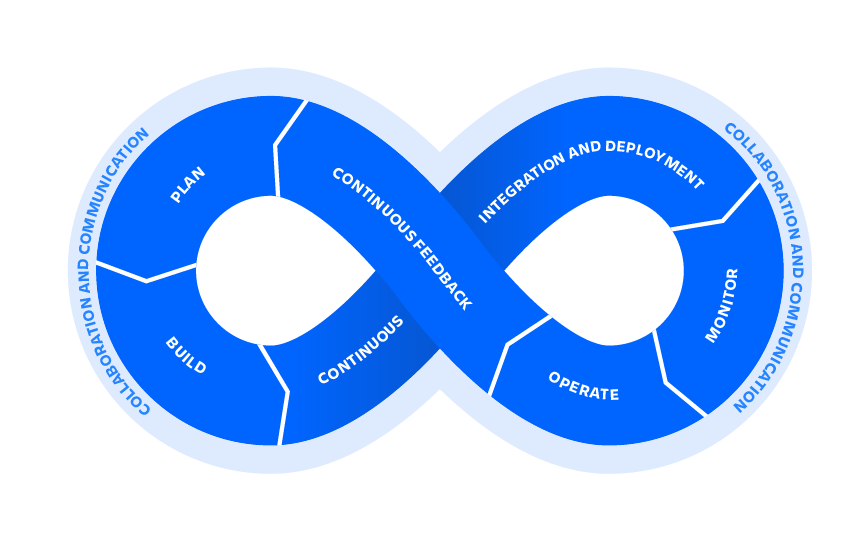

# CORE Code School

# Gitflow: Git in the Real World

Tras haber visto el funcionamiento basico de `git`, podemos concluir que hay diferentes maneras de trabajar con él. Y la organización de las ramas y el flujo de trabajo puede parecer muy compleja.

Pero ya hay `standards` en la industria preparados para facilitar el flujo de trabajo de los desarolladores y garantizar el mejor resultado en el producto final. Cada equipo y empresa tendrá sus particularidades en la metodologia, pero en esa lección veremos los conceptos basicos del trabajo con `gitflow` y `continuous delivery`.

Esas herramientas son parte de un conjunto de practicas llamado `DevOps`, que visa integrar y automatizar el trabajo entre los desarolladores de software (Dev) y los equipos de TI (Ops). El DevOps une git, agile, continuous delivery y otras practicas para que el proceso de los equipos sea más eficiente.



## Gitflow basics

Utilizar el modelo gitflow no difere de usar `git` como visto previamente, pero sino que usaremos git con una estrutura predeterminada.

> Para facilitar la estruturación de las ramas, tags, etc, podemos instalar y utilizar un `wrapper` (extensión) para git especializado en [git-flow](https://github.com/nvie/gitflow/wiki/Installation).
>
>En el caso de no utilizar ese wrapper, las ramas deben ser creadas, mergeadas y cerradas con los comandos tradicionales vistos en lecciones previas. Pero utilizandolo, el proceso se torna un poco más sencillo. En las secciones abajo veremos el comando para cada tipo de estructura.

## Structure
En el modelo de `continuous delivery`, siempre tendremos 2 ramas:

> ### Master
> Esa es la rama principal y más importante de el proyecto. Esa rama contiene a cada momento la ultima versión de nuestro programa.

> ### Develop
> Paralelamente a la rama `master`, tenemos la rama develop, donde ocurrirá (indiretamente) el desarollo de nuestro software.


Esas dos ramas son las unicas dos ramas permanentes de nuestro proyecto. La rama develop contendrá toda la evolución de nuestro software, mientras la rama master contendrá un resumo con apenas las versiones lanzadas oficialmente.

> Utilizamos el siguiente comando para iniciar un repo con el modelo gitflow:
>```shell
>git flow init
>```
> El inicializador nos permitirá cambiar los nombres y prefijos para los diferentes tipos de ramas si así deseamos.
>
> ---
>
> 

Todas las demás ramas seran provisorias y solo existirán mientras sean necesárias.

---

> ### Feature
> Cuando queramos crear una nueva característica (`feature`) para nuestro programa, crearemos una rama para tal. Esa rama se creará a partir de la rama `develop` y cuando esté listo el desarollo, volverá a integrarse (por merge) a esa. Cuando esté cumplido el merge, ya no será necesaria esa rama y por lo tanto será borrada.


> Creamos una nueva feature y la cerramos con los comandos
>```shell
>git flow feature start <name>
>git flow feature finish <name>
>```

---

> ### Release
> Igualmente cuando estémos listos para publicar una nueva versión lo haremos a traves de una rama del tipo release. Esa rama es muy parecida a la rama `feature`, se crea a partir de la rama develop. La diferencia es que al terminar esa rama, el merge se hará simultaneamente a `develop` y `master`. Con el cierre de esa rama, se publicará una nueva versión de nuestro programa.


> Creamos una nueva feature y la cerramos con los comandos
>```shell
>git flow release start <version>
>git flow release finish <version>
>```

La numeración de versiones no es una secuencia aleatoria de numeros, sino que son trés numeros separados por puntos, por ejemplo `1.0.1`. Cada uno de esos numeros tiene un significado específico. 

- El primero se refiere a `Major` version changes, o grandes cámbios en el software
- El segundo a `Minor` version changes, o cambios menores en el software
- Y el tercer a `Patches`, o la corrección de bugs

Ese sistema se llama `Semantic Versioning` o `SemVer`. Puedes leer más sobre en [semver.org](https://semver.org/).

---

> ### Hotfix
> El ultimo tipo de rama más comunmente usado son las ramas `hotfix`, que esperamos nunca necesitar. El objetivo de esas ramas es corregir algun `bug` que haya en una versión oficial y que no pueda esperar un siguiente release. Por la urgéncia de esa situación, la rama de hotfix se crea directamente de `master` y al cerrarse se integra a ambas master y develop.


> Creamos un nuevo hotfix y la cerramos con los comandos
>```shell
>git flow hotfix start <name>
>git flow hotfix finish <name>
>```

## Decentralized Centralized model
De esa manera, el trabajo se realiza de una manera más eficiente y se minizan los problemas de integración, pues las 2 ramas importantes son compartidas entre todos y las demás ramas dejan de existir cuando cumplan sus funciones.